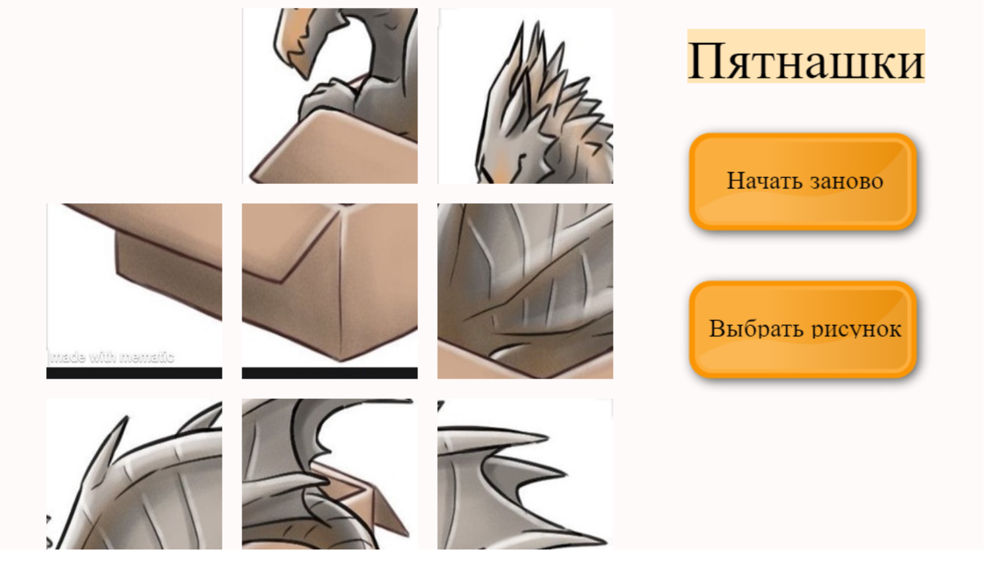

# Пятнашки "Malevich Puzzle"

Этот проект - игра в пятнашки.

<!-- TABLE OF CONTENTS -->

  
Содержание

  <ol>
    <li>
      О проекте
    </li>
    <li>
      Подготовка
    </li>
    <li>Использование</li>
    <li>Контакты</li>
  </ol>

 

<!-- ABOUT THE PROJECT -->
## О проекте

Данный проект позволяет сыграть в такую головоломку как пятнашки. В данный момент доступно для выбора 2 картинки (кот и дракон в коробке), из частей которых нужно будет собрать рисунок. Часть изображения перемещается после нажатия на нее в свободную зону. Если становится сложно, пожно перезапустить игру. Если хочется чего-то нового - можно поменять рисунок.
 

### Создано с использованием pgzero

![pgzero][Flask.com]

<!-- GETTING STARTED -->
## Подготовка

Для начала игры нужно будет скачать папку с проектом, python и библиотеку pgzero.

---------
<!-- USAGE EXAMPLES -->

## Использование

Этот проект поможет приятно провести время, решая логические задачки. Если вы впервые слышите про эту игру, о ней можно прочитать [здесь](https://ru.wikipedia.org/wiki/Игра_в_15).  
А ниже вы увидете результат работы приложения:

  

<!-- CONTACT -->
## Контакты

* Kseniya Evdokimova - k.evdokimova@kodland.team
* Telegram - @KseniyaEv

<!-- MARKDOWN LINKS & IMAGES -->

[Flask.com]: https://img.shields.io/badge/Python-14354C?style=for-the-badge&logo=python&logoColor=white
[Flask-url]: https://flask.palletsprojects.com/en/latest/
